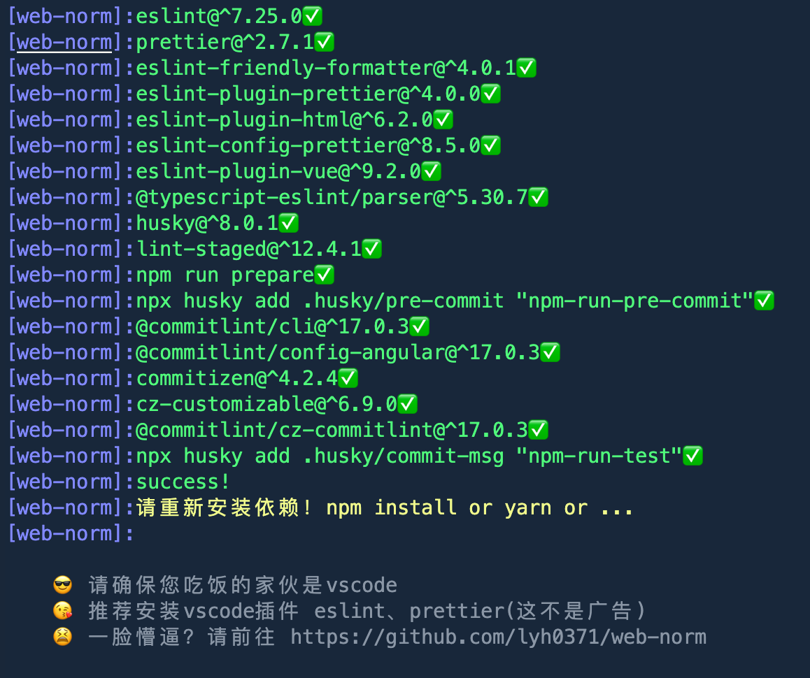
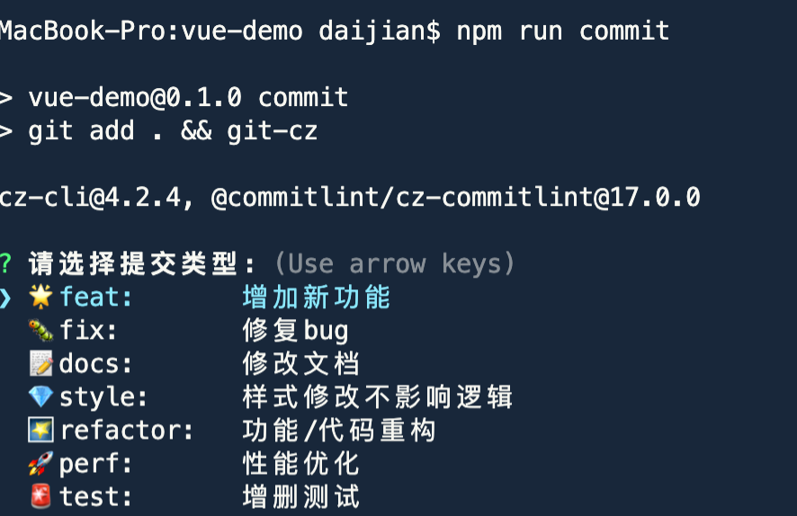
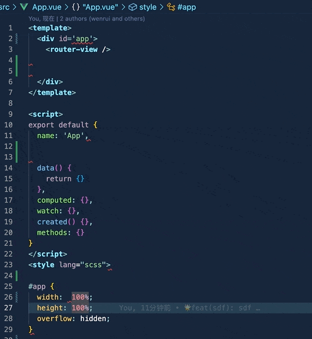
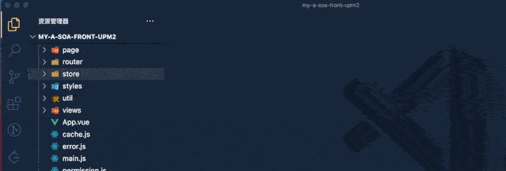

<br />
<h1 align="center">web-norm</h1>
<p align="center">
<a href="https://github.com/lyh0371/web-norm/stargazers"></a>
<a href="https://github.com/lyh0371/web-norm/network"></a>
</p>

## 其他性感的开源项目 🔥🔥

[vv-react-table(虚拟列表解决方案)](https://github.com/lyh0371/vv-react-table) 欢迎使用 😚
[web-guide(与框架无关的前端动态新手引导插件)](https://github.com/lyh0371/web-guide)欢迎使用 😚
[sp-ui(基于 vue3+vite2 的组件库-小玩意)](https://github.com/lyh0371/sp-ui)欢迎把玩 😚

## 初衷

每当接手一个新项目（如果项目中没有配置 eslint husky commitlint）等这些规范的话，就需要自己手动配置一遍，配置多了后我只能来句窝草！😬

## 目标

一个命令自动化配置项目规范

## 你将得到

- 保存代码自动格式化 💯
- 提交前 commit 校验 💯
- eslint + pretter 校验 💯
- husky 自动装载 💯
- 说吧，你还想要啥...

## 安装

1 局部安装（推荐使用）

```sh
npm install web-norm -D | yarn add web-norm -D | pnpm install web-norm -D
```

在 package.json 中

```sh
 "scripts": {
    "web-norm": "web-norm",
  },
```

2. 全局安装

```sh
npm install web-norm -g | yarn add web-norm -g | pnpm install web-norm -g
```

## 使用

运行命令

```tip
请确保您的项目使用了git，否则会导致`husky`不生效
```

```sh
npm run web-norm
```



## 支持配置

`web-norm` 默认在提交记录上为带表情符号 📦👷📝🌟🐛🚀🌠🔂💎🚨 。如果不喜欢这些表情符号的话可以在用 `web-norm` 初始化项目的时候加上 `--noEmoji` 去掉

```sh
 "scripts": {
    "web-norm": "web-norm --noEmoji",
  },
```

## 验证

代码提交前校验

```sh
npm run commit
```



## 在老项目中使用

在老项目使用会牵扯到一个问题就是以前的代码规范和通过`web-norm`生成的代码规范不一致怎么办？

1、如果项目比较小，只有几个文件，你可以把所以的文件都保存一遍即可（保存的时候 vscode 会自动格式化代码，确保使用 vscode 编辑器并安装 eslint 和 pretter 插件）



2、如果项目比较大，建议使用 vscode 插件`Format Files`进行自动化保存



## 可能遇到问题，详细内容参考这篇文章[可能遇到问题](https://juejin.cn/post/7124196350446534670#heading-4)

- husky 无法触发

1. 项目首先需要被 `git` 管理

2. mac 电脑执行 `npm run postinstallmac` 来设置 husky 的读写权限

## 说明

1.  `web-norm` 只支持 vue（包括 vue3）及 react 项目

2.  在使用过程中遇到任何问题，请提交 issues 😚
